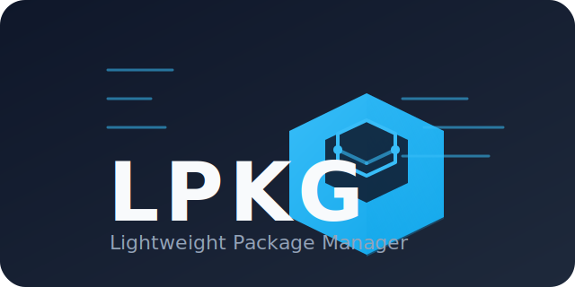

# 🧬 LPKG – Lightweight Package Manager

<p align="center">
  
</p>

LPKG is a minimalistic package manager written in Rust, designed for fast and simple software management on Unix-like systems. It emphasizes reproducibility and declarative configuration, leveraging **Nix Flakes** for development and deployment.

---

## 🚀 Features

* **Fast & Lightweight** – Minimal resource usage and quick operations.
* **Rust-Powered** – Safe and concurrent code with Rust.
* **Cross-Platform** – Works on Linux and macOS.
* **Declarative Builds** – Fully reproducible with Nix Flakes.
* **Simple CLI** – Intuitive commands for managing packages.

---

## ⚙️ Installation

### Using Cargo

```bash
cargo install lpkg
```

### Using Nix Flakes

If you have Nix with flakes enabled:

```bash
nix profile install github:lesbiannix/lpkg
```

Or to run without installing:

```bash
nix run github:lesbiannix/lpkg
```

---

## 🧰 Usage

Basic command structure:

```bash
lpkg [command] [package]
```

Common commands:

* `install` – Install a package
* `remove` – Remove a package
* `update` – Update the package list
* `upgrade` – Upgrade all installed packages

For detailed usage:

```bash
lpkg --help
```

---

## 🔧 Development with Flakes

Clone the repository:

```bash
git clone https://github.com/lesbiannix/lpkg.git
cd lpkg
```

Enter the flake development shell:

```bash
nix develop
```

Build the project:

```bash
cargo build
```

LPKG ships with tuned Cargo profiles:

* **Dev builds** (`cargo build`) use `opt-level=0`, lots of codegen units, and incremental compilation for quick feedback while hacking.
* **Release builds** (`cargo build --release`) enable `-O3`, fat LTO, and panic aborts for slim, fast binaries.
* **GraphQL builds** add the server components when you need them:

```bash
cargo build --features graphql
```

**PGO builds** are a two-step flow using the provided Cargo aliases:

```bash
# 1) Instrument
RUSTFLAGS="-Cprofile-generate=target/pgo-data" cargo pgo-instrument
# run representative workloads to emit *.profraw files under target/pgo-data
llvm-profdata merge -o target/pgo-data/lpkg.profdata target/pgo-data/*.profraw

# 2) Optimise with the collected profile
RUSTFLAGS="-Cprofile-use=target/pgo-data/lpkg.profdata -Cllvm-args=-pgo-warn-missing-function" \
  cargo pgo-build
```

Regenerate project artefacts (README and SVG logo):

```bash
cargo run --bin readme_gen
cargo run --bin logo_gen
```

Run tests:

```bash
cargo test
```

You can also run the project directly in the flake shell:

```bash
nix run
```

## 🕸️ GraphQL API

LPKG now ships a lightweight GraphQL server powered by Actix Web and Juniper.

* Start the server with `cargo run --features graphql --bin graphql_server` (set `LPKG_GRAPHQL_ADDR` to override `127.0.0.1:8080`).
* Query endpoint: `http://127.0.0.1:8080/graphql`
* Interactive playground: `http://127.0.0.1:8080/playground`

Example query:

```graphql
{
  packages(limit: 5) {
    name
    version
    enableLto
  }
  randomJoke {
    package
    text
  }
}
```

### AI metadata tooling

The AI metadata store under `ai/metadata/` comes with a helper CLI to validate package records against the JSON schema and regenerate `index.json` after adding new entries:

```bash
cargo run --bin metadata_indexer -- --base-dir . validate
cargo run --bin metadata_indexer -- --base-dir . index
```

Use `--compact` with `index` if you prefer single-line JSON output.

To draft metadata for a specific book page, you can run the harvest mode. It fetches the XHTML, scrapes the build commands, and emits a schema-compliant JSON skeleton (pass `--dry-run` to inspect the result without writing to disk):

```bash
cargo run --bin metadata_indexer -- \
  --base-dir . harvest \
  --book mlfs \
  --page chapter05/binutils-pass1 \
  --dry-run
```

Keep the jhalfs manifests current with:

```bash
cargo run --bin metadata_indexer -- --base-dir . refresh
```

Passing `--books mlfs,blfs` restricts the refresh to specific books, and `--force` bypasses the local cache.

To materialise a Rust module from harvested metadata:

```bash
cargo run --bin metadata_indexer -- \
  --base-dir . generate \
  --metadata ai/metadata/packages/mlfs/binutils-pass-1.json \
  --output target/generated/by_name
```

Add `--overwrite` to regenerate an existing module directory.

## 📚 Documentation

* [Architecture Overview](docs/ARCHITECTURE.md) – high-level tour of the crate layout, binaries, and supporting modules.
* [Metadata Harvesting Pipeline](docs/METADATA_PIPELINE.md) – how the metadata indexer produces and validates the JSON records under `ai/metadata/`.
* [Package Module Generation](docs/PACKAGE_GENERATION.md) – end-to-end guide for converting harvested metadata into Rust modules under `src/pkgs/by_name/`.
* Concept corner: [Nixette](concepts/nixette/README.md) – a NixOS × Gentoo transfemme mash-up dreamed up for fun brand explorations.
* `ai/notes.md` – scratchpad for ongoing research tasks (e.g., deeper jhalfs integration).

---

## 📄 License

LPKG is licensed under the [MIT License](LICENSE).

